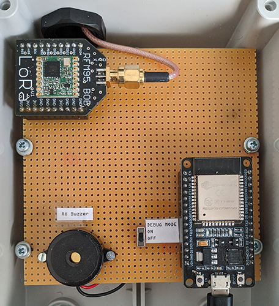

# LoRa Receiver

## Image of the prototype

{ width=50% }

## Project setup

1. Install Make (through GnuWin): <https://gnuwin32.sourceforge.net/packages/make.htm>
2. Install Arduino CLI: <https://docs.arduino.cc/arduino-cli/installation/>\
*Optional:* Install Arduino IDE: <https://www.arduino.cc/en/software/>

3. Install the esp32 platform
    - Using CLI: `arduino-cli core install esp32:esp32`
    - Using Arduino IDE:
      - Open **Boards Manager** and search for "esp32" & install it

4. Install libraries
    - Using CLI:

      ```bash
      arduino-cli lib install "ArduinoJson"
      arduino-cli lib install "CayenneLPP"
      
      ```

    - Using Arduino IDE:
      - Open **Library Manager** and search for the libraries above & install them

5. Install the LoRa library manually (because some functions are missing if installed through command line or Library Manager)
    - Download the library in ZIP from: <https://github.com/sandeepmistry/arduino-LoRa>
    - There are two options for installing:
        1. Extract it to C:\Users\UserName\Documents\Arduino\libraries\LoRa
        2. In Arduino IDE, go to Sketch -> Include Library -> Add .ZIP Library...

6. Build the project
    - Using CLI: `make` or `make compile`
    - Using Arduino IDE: Use the Verify button

7. Upload the project to the MCU
    - Using CLI:
      - set the correct PORT in the Makefile
      - `make upload`
    - Using Arduino IDE:
      - Set the board to DOIT ESP32 DEVKIT V1 and select the correct COM port
      - Use the Upload button

## WiFi setup

1. Create a `config.cpp` file in the `src` directory
2. Add the following code to the `config.cpp` file:

```cpp
#include "src/config.h"

const char *ssid = "your_wifi_ssid";
const char *password = "your_wifi_password";
const char *serverUrl = "server_url"; // e.g. "https://example.com/api"
```
